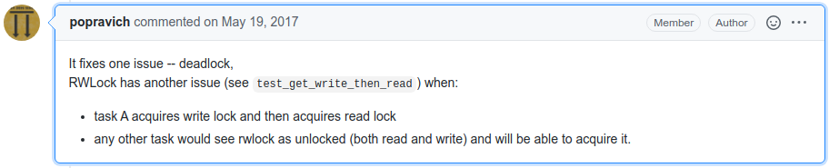

# aiorwlock

Demonstrates a [bug](https://github.com/aio-libs/aiorwlock/pull/37#issuecomment-302660466) that was fixed in [aiorwlock](https://github.com/aio-libs/aiorwlock).

[aiorwlock_bug.tla](aiorwlock_bug.tla) and [aiorwlock.tla](aiorwlock.tla) represent the lock before and after [the fix](https://github.com/aio-libs/aiorwlock/pull/39/commits/104f81bd7f886029e3b755ca8cf39d1c886c98e3). [aiorwlock.tla](aiorwlock.tla) was only changed slightly from the [original spec](https://github.com/aio-libs/aiorwlock/blob/853b736/spec/aiorwlock.tla).

## References
* Original spec: https://github.com/aio-libs/aiorwlock/blob/853b736/spec/aiorwlock.tla
* Talk (in Russian): https://www.youtube.com/watch?v=gRr9ymtAN6E
* Slides (in English): https://www.slideshare.net/MykolaNovik/verification-of-concurrent-and-distributed-systems
