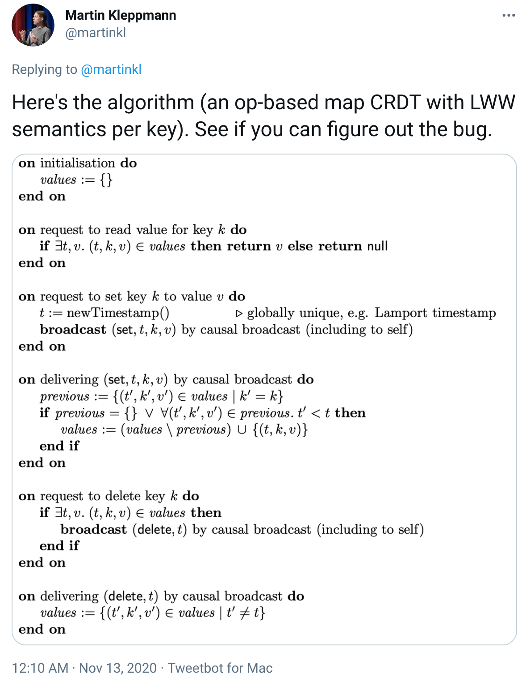
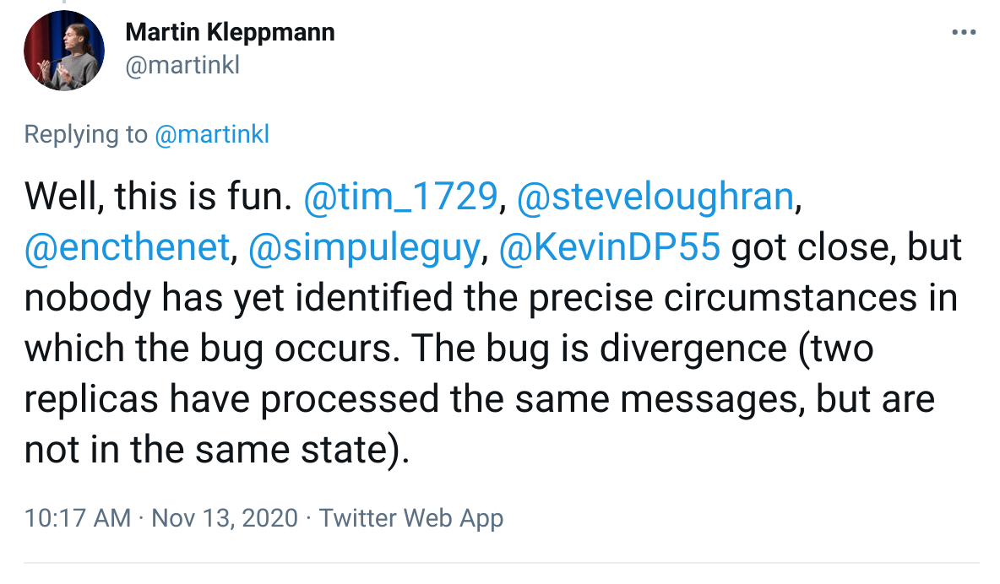
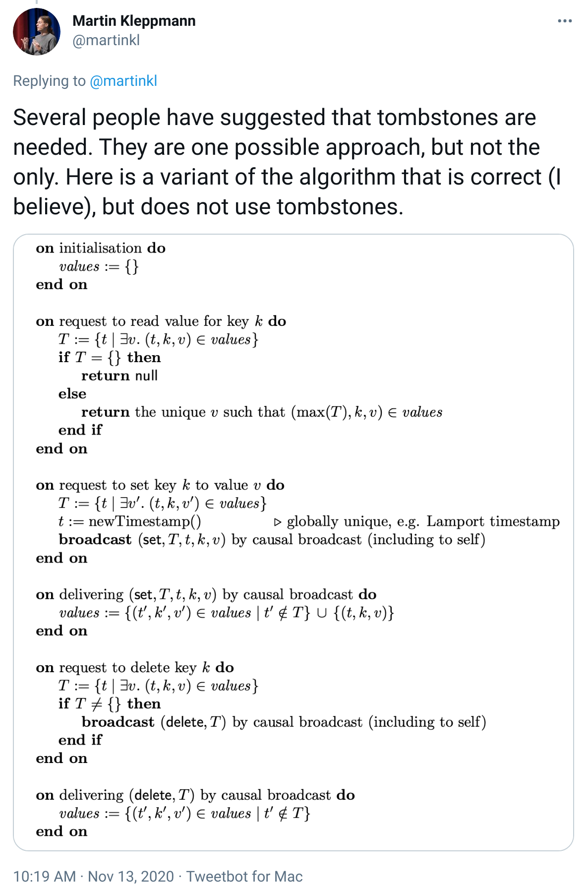
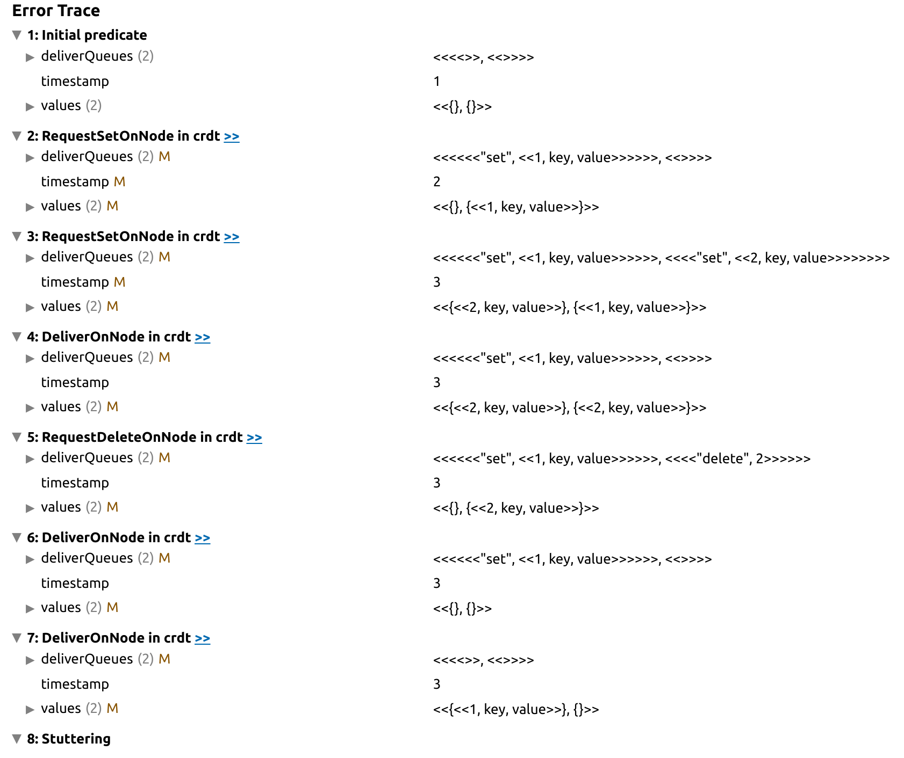

# CRDT-Bug

The two specs are based on this [twitter thread](https://twitter.com/martinkl/status/1327025979454263297). I tried to make minimal specs which look similar to the pseudocode.

* [crdt](crdt) is the algorithm from https://twitter.com/martinkl/status/1327025979454263297 where the `EventuallyConsistent` property fails.
* [crdt-fixed](crdt_fixed) is the algorithm from https://twitter.com/martinkl/status/1327179176521166853 where no violation of `EventuallyConsistent` is found by the model checker (at least with the given configuration).

## Relevant tweets from the thread

## Results

Checking [crdt.tla](crdt/crdt.tla) gives an error trace which shows the the same issue as https://twitter.com/sreejas/status/1327191953474203648/

