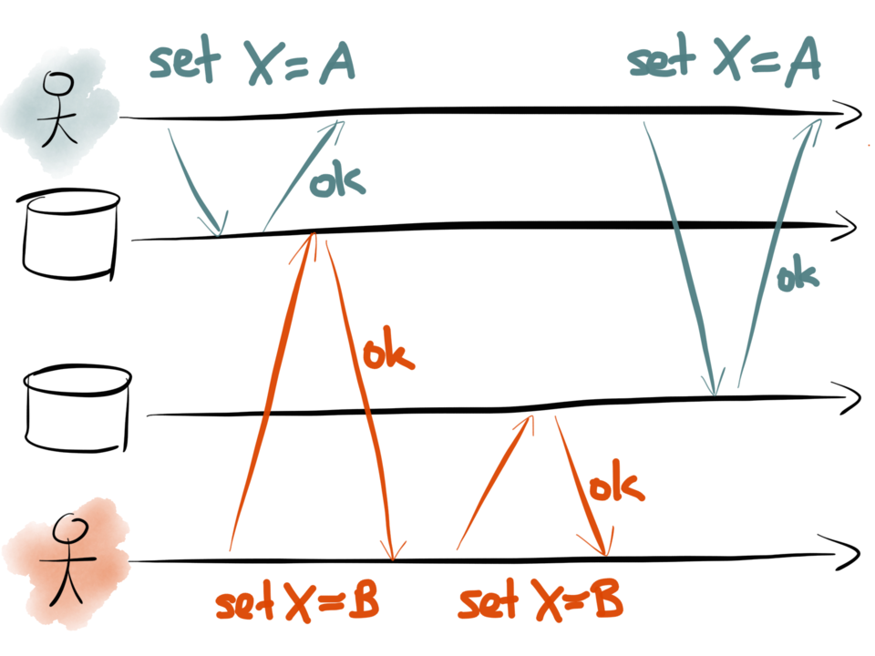

# Dual Writes

Demonstrates a race condition described in https://martin.kleppmann.com/2015/05/27/logs-for-data-infrastructure.html, image from Martin Kleppmanns talk:

## TODO:
Try to visualize the error trace with [ShiViz](https://bestchai.bitbucket.io/shiviz/) and the [ShiViz TLA+ community module](https://github.com/tlaplus/CommunityModules/blob/master/modules/ShiViz.tla) as described in this [issue](https://github.com/tlaplus/tlaplus/issues/267#issuecomment-481951259).

