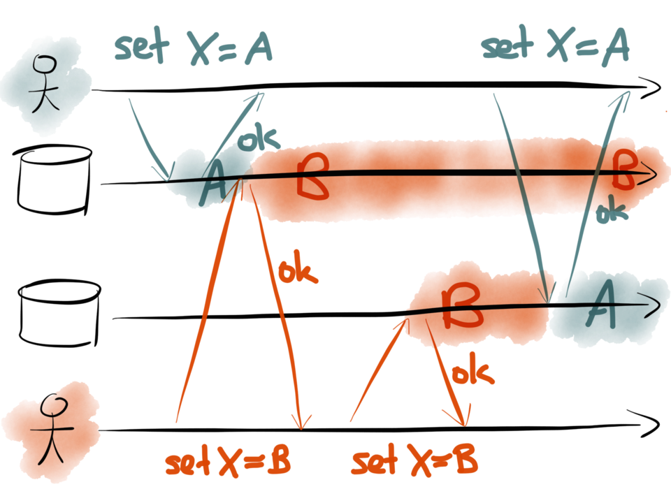
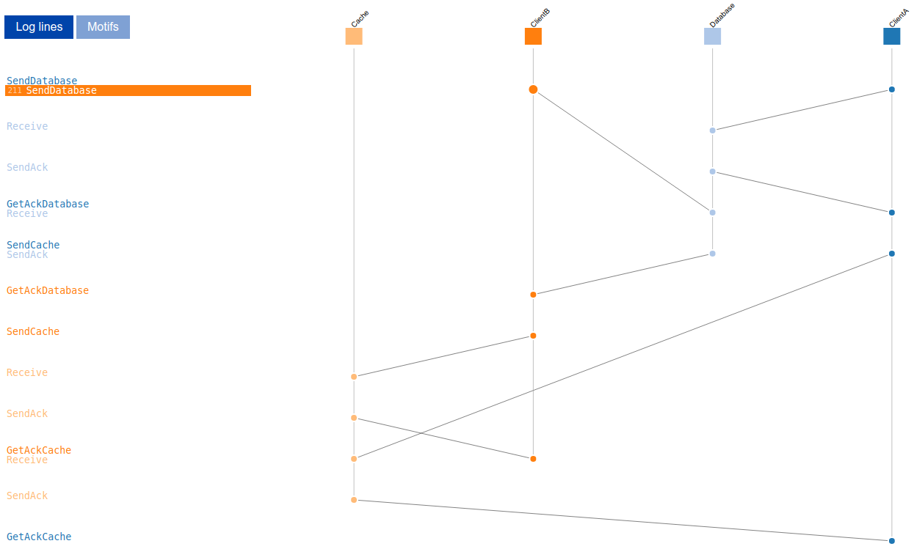

# Dual Writes

Demonstrates a race condition described in https://martin.kleppmann.com/2015/05/27/logs-for-data-infrastructure.html, image from Martin Kleppmanns talk:

There are four specs which model this problem in slightly different ways:
* [dual_writes.tla](simple/dual_writes.tla)
* [dual_writes_shiviz.tla](shiviz/dual_writes_shiviz.tla)
* [dual_writes_vector_clock.tla](vector_clock/dual_writes_vector_clock.tla)
* [dual_writes_channels.tla](channels/dual_writes_channels.tla)

While [dual_writes.tla](dual_writes.tla) is enough to show the problem, it would be nice to get a visualization of the error similar to the image above.

There is a [ShiViz TLA+ community module](https://github.com/tlaplus/CommunityModules/blob/master/modules/ShiViz.tla) which can be used to generate input for [ShiViz](https://bestchai.bitbucket.io/shiviz/) as described in this [issue](https://github.com/tlaplus/tlaplus/issues/267#issuecomment-481951259).  Unfortunately this orders the events as they appear in the error trace, which does not reflect the causal relationships in the system. For example with [dual_writes_shiviz.tla](dual_writes_shiviz.tla)
we can get a visualization from it's [trace](traces/bad_trace.txt) like this where the lines don't match the message exchange in our system:

To get a more useful visualization we have to implement vector clocks as in [dual_writes_vector_clock.tla](dual_writes_vector_clock.tla):

You can use it's [error trace](traces/dual_writes_vector_clock.out) as input to ShiViz to try out the interactive version.

A similar thing can be achieved with https://github.com/dmilstein/channels as in [dual_writes_channels.tla](channels/dual_writes_channels.tla).

Note that you might need to make a small [change](https://github.com/dmilstein/channels/pull/3) to create the visualization and that the module seems to expect strings instead of model values.
